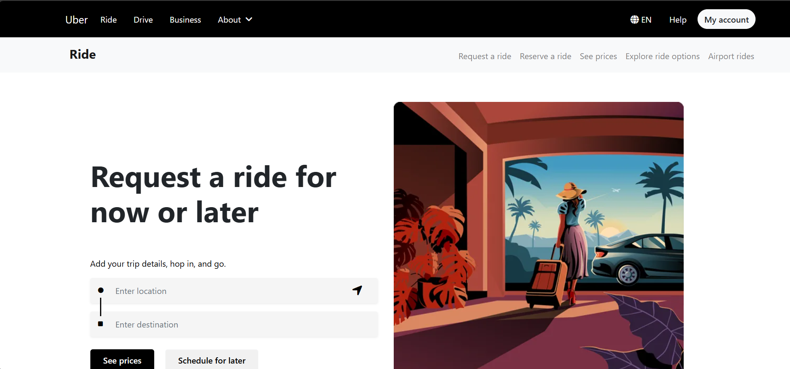
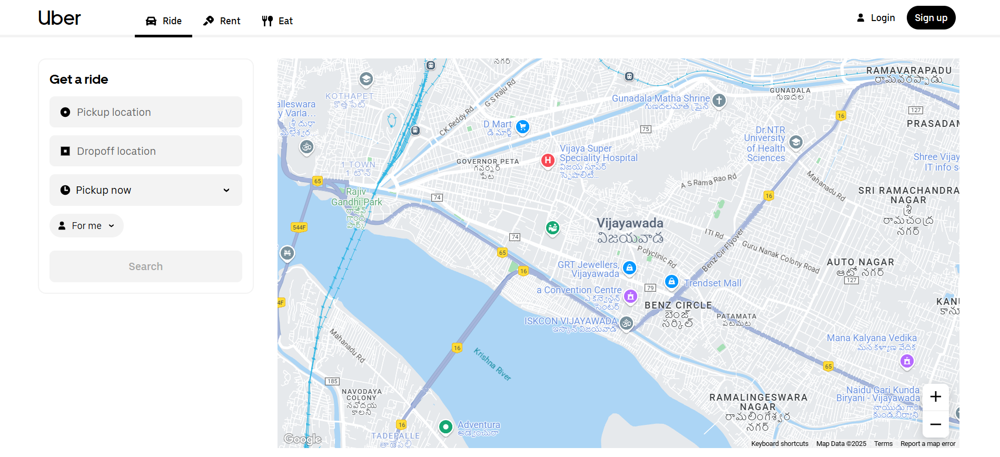
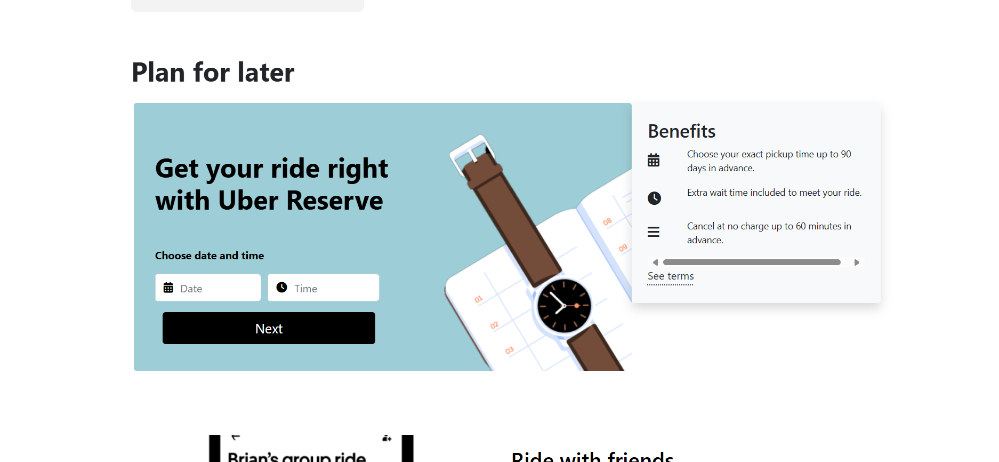
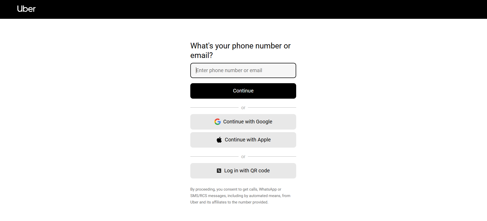
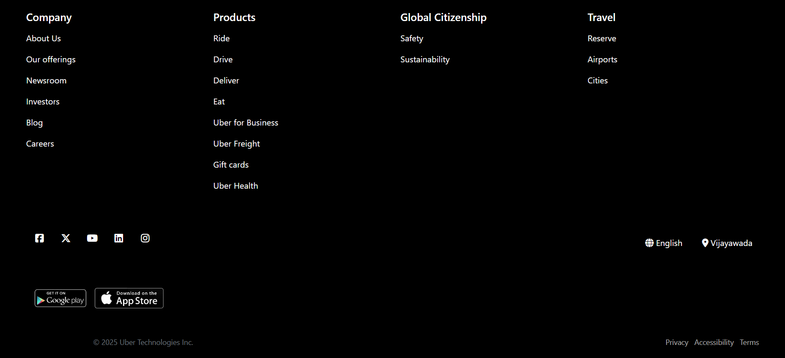
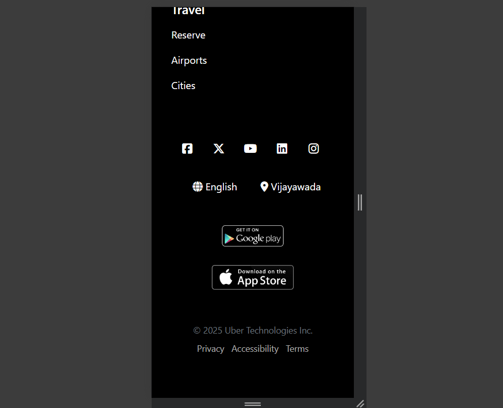

# 🚗 Responsive Uber Clone

**Responsive Uber Clone** is a web-based platform that replicates the Uber ride-hailing experience. This project is designed with HTML, CSS, and Bootstrap to provide a responsive, user-friendly interface for booking rides. Although it lacks backend functionality, the front-end mimics the Uber platform's layout and ride options with a focus on design and user experience.

---

## 🚀 Features

### 🧑‍🤝‍🧑 General Users
- 🚖 **Browse Available Rides**  
- 🗺️ **View Location and Ride Types (e.g., UberX, UberXL)**  
- 🔍 **Search for Rides Based on Location**  
- 🖥️ **Responsive Design for Mobile and Desktop**

---

## 🛠 Tech Stack

- **Frontend**: HTML, CSS, Bootstrap  
- **Design Framework**: Bootstrap 4/5 (for responsiveness and UI components)  
- **Map Representation**: Google Maps API (Static Maps)  

---

## 📸 Screenshots

| Homepage | Ride Options | Booking Section |
|---------|--------------|-----------------|
|  |  |  |

| Login Page | Footer Section | Mobile View |
|------------|-----------------|-------------|
|  |  |  |

---

## ⚙️ Installation & Setup

1. **Clone the repository**  
   First, clone the repository to your local machine:
   ```bash
   git clone https://github.com/yourusername/responsive-uber-clone.git
   cd responsive-uber-clone
2. **Open the project**
   Open the index.html file in your browser to view the project.
## 📝 Acknowledgements
 ### Bootstrap - For responsive design and UI components.

### Google Maps API - For the map and location features (static).

### Font Awesome - For icons used in the interface.
